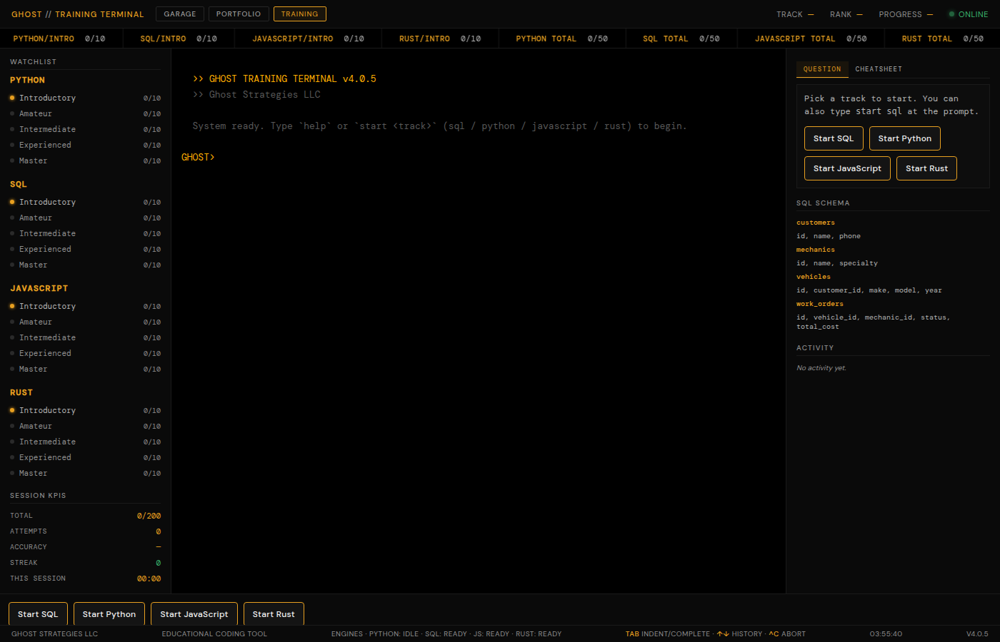

# Ghost Training Terminal

[](https://github.com/KaeJhee/training-terminal/actions/workflows/ci.yml)


**Live demo:** [kaejhee.github.io/training-terminal](https://kaejhee.github.io/training-terminal/)



A browser trainer for SQL, Python, JavaScript, and Rust. Four tracks, five
tiers, ten questions each (200 total). It looks like a terminal. It is a
practice tool, not a brokerage product and not investment advice.

## What you can do with it

- Pick a track and answer questions in the page. SQL runs in SQLite, Python
  runs in Pyodide, JavaScript runs in a Web Worker. Rust is checked against
  a canonical form. There is no Rust compiler in the page.
- Read a short lesson and a language cheatsheet beside the question.
- Progress stays in this browser (`localStorage`). Export and import it as
  JSON if you want a copy.

## How an answer is checked

| Track | What runs | What "correct" means |
|---|---|---|
| SQL | sql.js (SQLite, vendored) | Your result set matches the expected query. The database is rebuilt between the two. |
| Python | Pyodide 0.29.5, in a worker, loaded when you start Python | A variable, a printed line, or a call matches the expected value. Some questions run a second hidden input so a pasted literal does not pass. |
| JavaScript | A fresh Web Worker per attempt | Same idea, plus floating-point checks with an explicit tolerance. |
| Rust | No execution | Whitespace, comments, and a few equivalent spellings are normalized, then the text is compared to a canonical answer. `let x: bool = true;` is accepted when the canon omits the type. A wrong program that happens to look like the canon can still pass. |

Ctrl+C aborts a running Python or JavaScript attempt. Python that never
returns is stopped after 5 seconds and the runtime restarts.

## Honest limits

- **JavaScript is not a sealed sandbox.** `fetch` and the other network and
  storage names are deleted on the worker global and on its prototypes, and
  the page Content-Security-Policy limits connections to this site and
  jsDelivr. The grader uses `eval` (`'unsafe-eval'` is in the policy) because
  that is how learner code runs. Do not paste secrets into an answer.
- **Rust is not compiled.** The grader does not catch type errors that the
  canonical string does not mention. A trailing comment or an extra type
  annotation is fine. A different correct program may be marked wrong.
- **Python needs jsDelivr** the first time you open that track (about 10 MB).
  If that CDN is blocked, Python falls back to a strict text match and says
  so. SQL, JavaScript, and the terminal shell are files in this repo.
- **Answer keys are in the page source.** This is practice, not an exam.
- Progress does not sync across devices. See `docs/performance.md`.

## Run it

```bash
python3 -m http.server
# open http://127.0.0.1:8000/
```

Opening `index.html` as a file will not load the worker or the wasm. Serve
the directory.

```bash
python3 build.py           # rebuild index.html and content-bundle.js
python3 build.py --check   # lint only
python3 tests/qa_harness.py
python3 tests/rust_variants.py
python3 tests/secret_scan.py
```

CI runs those, rebuilds, and grades every SQL, Python, and JavaScript
answer key in headless Chrome.

## Layout

```
index.html                  built shell (committed)
content-bundle.js           built lessons (committed)
pyodide-worker.js           Python grader worker
sw.js                       repeat-visit cache
build.py
src/index.template.html     page, questions, engines
src/content/{sql,python,javascript,rust}/
vendor/                     xterm, sql.js, fonts
tests/                      Rust harness, JS solutions, answer-key runner
docs/                       how it was built, performance notes
.github/workflows/ci.yml
CHANGELOG.md                version history
PROMPTS.md                  agent work plan (historical)
```

Version history lives in [CHANGELOG.md](CHANGELOG.md). How the agents were
checked lives in [docs/how-this-was-built.md](docs/how-this-was-built.md).

— Ghost Strategies LLC
